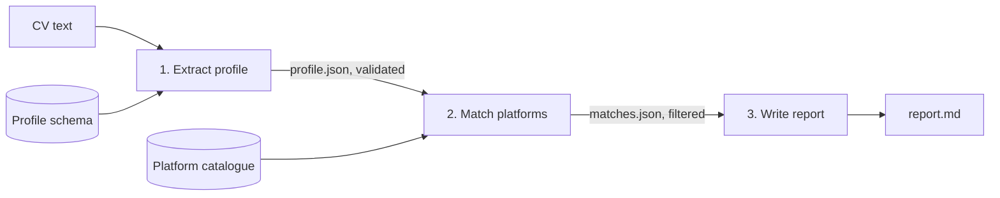

# CV → Platform Matching Workflow

A three-stage prompt chain that reads a CV, matches the candidate against a catalogue of AI training and annotation platforms, and writes a short advisory report. I built it to support a CV review service I run for people moving into AI training work.

## How it works



| Stage | Input | Output | Guardrails |
|---|---|---|---|
| 1. Extract | CV text + JSON schema | Structured profile | Facts only from the CV; nulls for missing fields; validated against the schema |
| 2. Match | Profile + platform catalogue | Fit rating per platform with evidence and unknowns | Every rating cites profile fields; unknown platforms are dropped; at least one fallback option required |
| 3. Report | Profile + matches | Markdown report under 700 words | No pay or acceptance claims; weak matches left out; reminder to check requirements |

### Design choices

- **Structured handoffs.** Each stage passes JSON, not prose, so the next stage can't pick up a claim the previous one only implied.
- **Evidence and unknowns are separate fields.** Stage 2 has to say what it couldn't confirm instead of assuming.
- **The catalogue is data, not prompt text.** Updating a platform means editing `config/platforms.yaml`, not rewriting prompts.
- **Retry on bad JSON.** If a reply doesn't parse, the runner asks again with a correction (up to two retries).
- **Tested offline.** `test_chain.py` runs the whole chain against a fake client, so the logic can be checked without an API key.

## Run it

```bash
pip install -r requirements.txt
export ANTHROPIC_API_KEY=...
python run_chain.py examples/sample_cv_fictional.md --out report.md --save-intermediate
```

Preview the first prompt without calling the API:

```bash
python run_chain.py examples/sample_cv_fictional.md --dry-run
```

Run the tests:

```bash
python -m pytest test_chain.py
```

## Files

```
prompts/01_extract_profile.md       stage 1 prompt
prompts/02_match_platforms.md       stage 2 prompt
prompts/03_write_report.md          stage 3 prompt
config/candidate_profile.schema.json
config/platforms.yaml               platform catalogue (review before real use)
run_chain.py                        runner
test_chain.py                       offline tests
examples/sample_cv_fictional.md     fictional input
examples/sample_report.md           illustrative output
```

## Limitations

- The platform catalogue gives general descriptions only. Requirements and regional eligibility change, so review it before giving real advice.
- The chain doesn't read PDFs or Word files directly. Convert the CV to text first.
- It advises; it doesn't decide. A person should review each report before it goes to a client.
